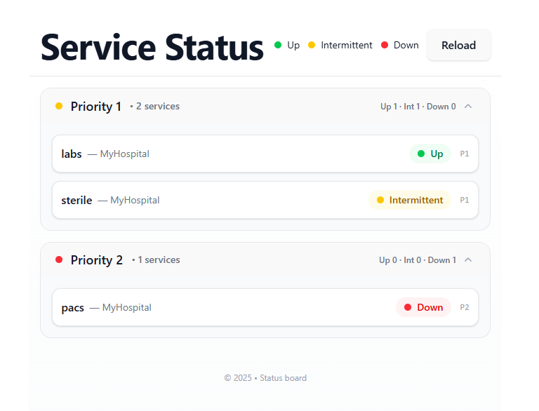
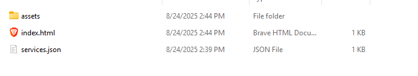

Downtime dashboard

(Screen shot of the service dashboard)


this requires a json file called `services.json` in the public

```example file
[
  {
    "priority": 1,
    "location": "MyHospital",
    "status": "up",
    "servicename": "labs"
  },
  {
    "priority": 2,
    "location": "MyHospital",
    "status": "down",
    "servicename": "pacs"
  },
  {
    "priority": 1,
    "location": "MyHospital",
    "status": "intermittent",
    "servicename": "sterile"
  }
]
```

## To get it running.

1. clone repo
2. in downtime/downtime run `npm i`
3. to test run `npm run dev`
4. to release run `npm run build` , this wil create a `dist` folder, just drop that at the web serving root.
   
   Finally, overwrite the `services.json` with any updates and click reload.

## licensing

- for use for free always
